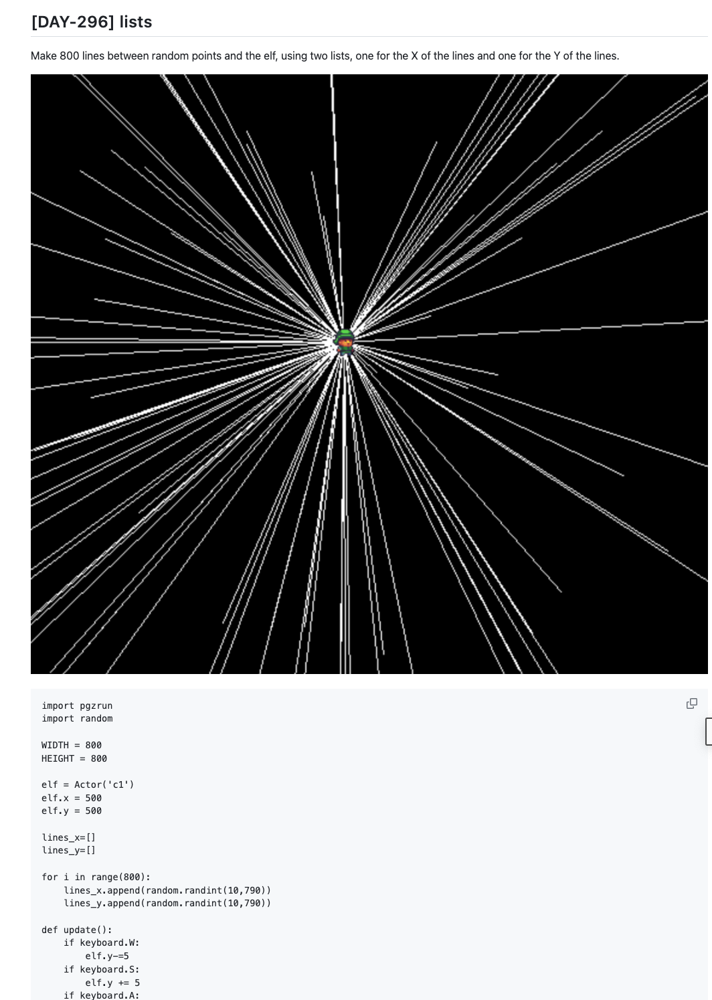

# PROGRAMMING FOR KIDS BOOK - [book.md](book.md)

The book is work in progress, so far I spent about 15 months adding to it, and teaching my daughter 2-3 times a week.

If you have any ideas or feedback, make a pull request, or send me an email to programmingtime@fastmail.com

Link to the book: [book.md](book.md)

Example page:

## Other projects

While writing the book we also developed few other projects:

* [4917](https://punkx.org/4917/) - card game to teach kids machine code
* [unix pipe game](https://punkx.org/unix-pipe-game/) - card game to teach kids basic unix commands
* [unix pipe game expansion: process-substitution](https://punkx.org/unix-pipe-game/ext-0.1) - card game to teach kids about process substitution
* [c-pointer-game](https://punkx.org/c-pointer-game) - card game to teach about pointers and values
* [programming-time](https://punkjazz.org/programming-time/) - card game to teach kids about reading code
* [punk0](https://punkx.org/punk0/) - punk zero: card game, like uno but with strategy
* [runlength-for-kids](https://punkx.org/runlength-for-kids/) - runlength encoding for kids puzzle card game
* [punk](https://punkjazz.org/punk/) - online game turn based python to move pieces on the board
* [overflow](https://punkx.org/overflow/) - RISCV assembly board game, win by executing buffer overflow
* [rocksolid](https://punkx.org/rocksolid/) - December 2023 egg drop challenge
* [calc](https://punkx.org/calc/) - single button (morse code) calculator
* [panic](https://punkx.org/panic/) - one mischief per card
## license

Creative Commons Attribution 4.0
