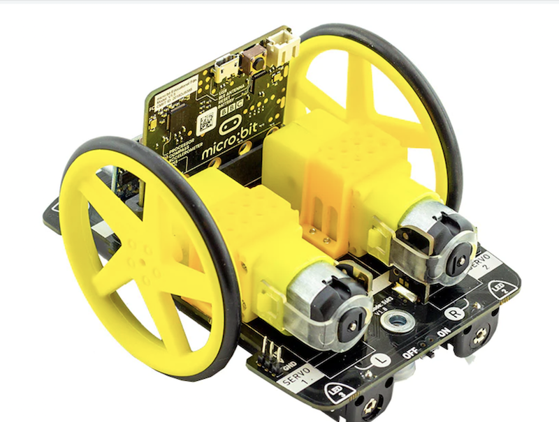
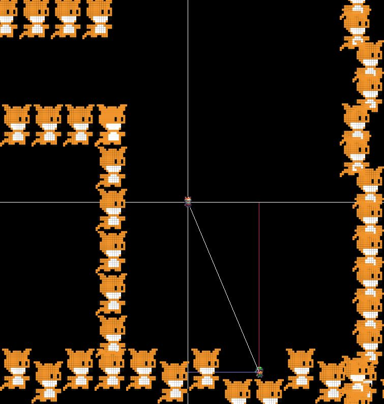
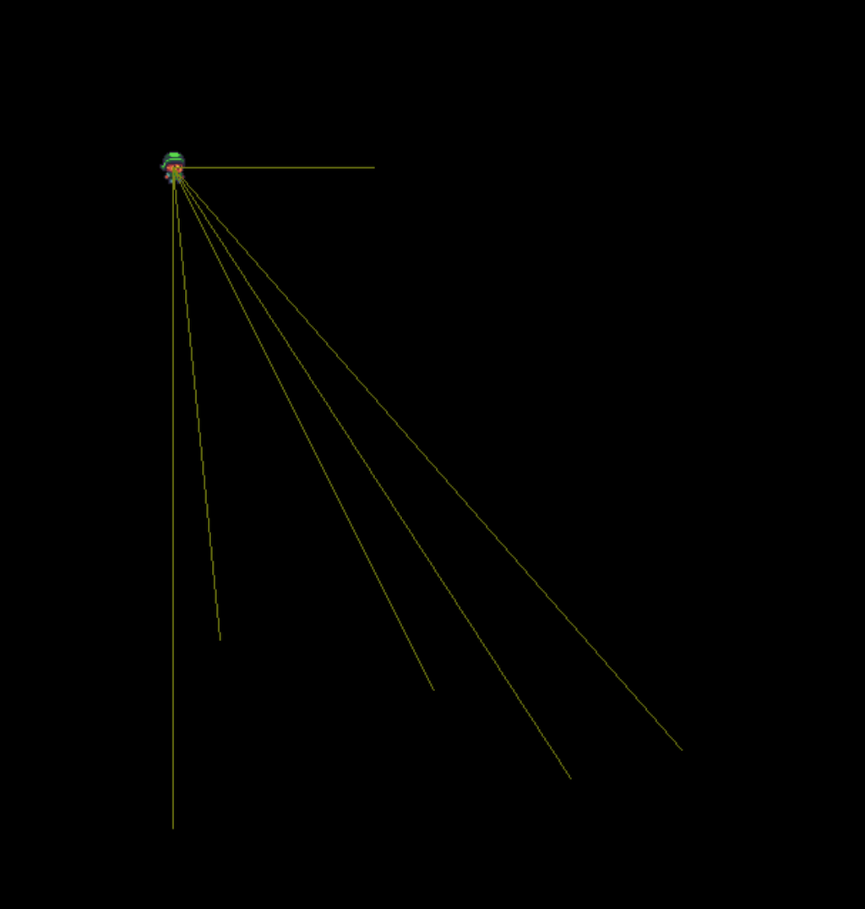
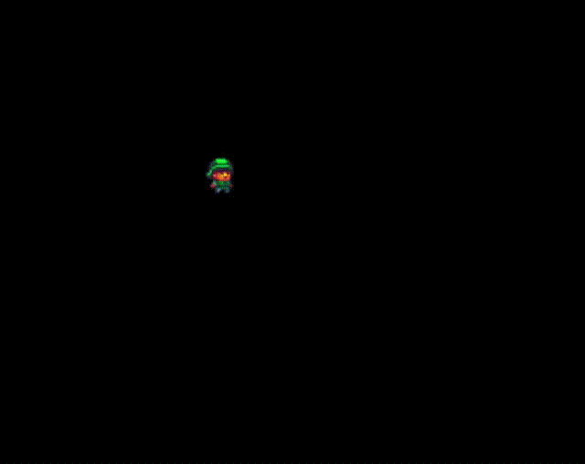
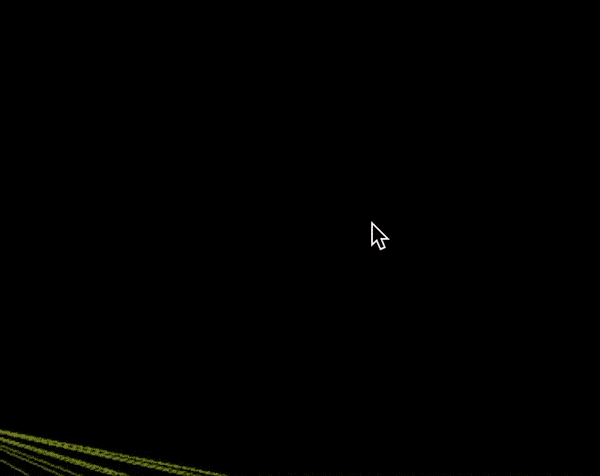

## [DAY-287] follow the line

Make a follow the line robot.

> we had microbit and kitronik kit, and this is the code she wrote (i wrote the helper functions)



```
def forward(n):
    Kitronik_Move_Motor.move(Kitronik_Move_Motor.DriveDirections.FORWARD,n)
def back(n):
    Kitronik_Move_Motor.move(Kitronik_Move_Motor.DriveDirections.REVERSE,n)

def turn_left(n):
    Kitronik_Move_Motor.motor_off(Kitronik_Move_Motor.Motors.MotorLeft)
    Kitronik_Move_Motor.motorOn(Kitronik_Move_Motor.Motors.MotorRight,Kitronik_Move_Motor.MotorDirection.Forward, n)
    
def turn_right(n):
    Kitronik_Move_Motor.motor_off(Kitronik_Move_Motor.Motors.MotorRight)
    Kitronik_Move_Motor.motorOn(Kitronik_Move_Motor.Motors.MotorLeft,Kitronik_Move_Motor.MotorDirection.Forward, n)

def distance():
    return Kitronik_Move_Motor.measure()

def rand(n):
    return int(Math.random() * n)

def sensor_left():
    return Kitronik_Move_Motor.read_sensor(Kitronik_Move_Motor.LfSensor.LEFT)

def sensor_right():
    return Kitronik_Move_Motor.read_sensor(Kitronik_Move_Motor.LfSensor.RIGHT)

def on_forever():
    left = sensor_left()
    right = sensor_right()
    if left>221:
        turn_right(30)
    elif right>221:
        turn_left(30)
    else:
        forward(2)

basic.forever(on_forever)
```


## [DAY-288] lines

Make two lines going through the center of the screen, and two lines from the elf to the y axis and the x axis

```
WIDTH = 800
HEIGHT = 800
...
def draw():
    screen.fill('black')
    elf.draw()
    screen.draw.line([elf.x,elf.y],[400,400],[255,255,255])
    screen.draw.line([elf.x,elf.y],[elf.x,400],[223,25,123])
    screen.draw.line([elf.x,elf.y],[400,elf.y],[132,123,231])
    screen.draw.line([0,400],[800,400],[255,255,255])
    screen.draw.line([400,800],[400,0],[255,255,255])
    ...
```




## [DAY-289] lines

Make a line between the elf and the king that moves with them.


```
import pgzrun
HEIGHT=800
WIDTH=800
elf=Actor("c1")
king=Actor("c2")

def update():
    if keyboard.W:
        elf.y-=5
    if keyboard.S:
        elf.y+=5
    if keyboard.A:
        elf.x-=5
    if keyboard.D:
        elf.x+=5

    if keyboard.D:
        elf.x+=5
    if keyboard.UP:
        king.y-=5
    if keyboard.DOWN:
        king.y += 5
    if keyboard.RIGHT:
        king.x+=5
    if keyboard.LEFT:
        king.x-=5

def draw():
    screen.clear()
    elf.draw()
    king.draw()
    screen.draw.line([elf.x,elf.y],[king.x,king.y],[123,132,19])


pgzrun.go()
```

## [DAY-290] lines

Make lines between many actors and the elf


```
import pgzrun
import random

HEIGHT=800
WIDTH=800
elf=Actor("c1")

kings=[]
for i in range(10):
    b=Actor("c2")
    b.x=random.randint(10,790)
    b.y=random.randint(10,790)
    kings.append(b)

def update():
    if keyboard.W:
        elf.y-=5
    if keyboard.S:
        elf.y+=5
    if keyboard.A:
        elf.x-=5
    if keyboard.D:
        elf.x+=5

def draw():
    screen.clear()
    elf.draw()
    for i in kings:
        screen.draw.line([elf.x,elf.y],[i.x,i.y],[123,132,19])

pgzrun.go()
```


## [DAY-291] lines

Make the lines move towards the elf, think about how would you do that if the elf and the other actor are on the same X or Y coordinate.




```
import pgzrun
import random

HEIGHT=800
WIDTH=800
elf=Actor("c1")

kings=[]
for i in range(10):
    b=Actor("c2")
    b.x=random.randint(10,790)
    b.y=random.randint(10,790)
    kings.append(b)

def update():
    if keyboard.W:
        elf.y-=5
    if keyboard.S:
        elf.y+=5
    if keyboard.A:
        elf.x-=5
    if keyboard.D:
        elf.x+=5

    for i in kings:
        if i.x > elf.x:
            i.x -= random.randint(0,3)
        if i.y > elf.y:
            i.y -= random.randint(0,3)
        if i.x < elf.x:
            i.x += random.randint(0,3)
        if i.y < elf.y:
            i.y += random.randint(0,3)

        
def draw():
    screen.clear()
    elf.draw()
    for i in kings:
        screen.draw.line([elf.x,elf.y],[i.x,i.y],[123,132,19])

pgzrun.go()
```





## [DAY-292] lines

Make the game into jumpscare game where you play a scary sound and show scary image after the lines catch you





```
import pgzrun
import random

HEIGHT=800
WIDTH=800
elf=Actor("c1")
scare=Actor("corgi")
game_over = False
kings=[]
for i in range(10):
    b=Actor("c2")
    b.x=random.randint(500,790)
    b.y=random.randint(500,790)
    kings.append(b)

def update():
    global game_over
    if keyboard.W:
        elf.y-=5
    if keyboard.S:
        elf.y+=5
    if keyboard.A:
        elf.x-=5
    if keyboard.D:
        elf.x+=5

    for i in kings:
        if i.x > elf.x:
            i.x -= random.randint(0,3)
        if i.y > elf.y:
            i.y -= random.randint(0,3)
        if i.x < elf.x:
            i.x += random.randint(0,3)
        if i.y < elf.y:
            i.y += random.randint(0,3)
        if elf.colliderect(i):
            game_over = True
            

        
def draw():
    screen.clear()
    elf.draw()
    for i in kings:
        screen.draw.line([elf.x,elf.y],[i.x,i.y],[123,132,19])
    if game_over:
        scare.draw()
        sounds.retro.play()

pgzrun.go()
```
