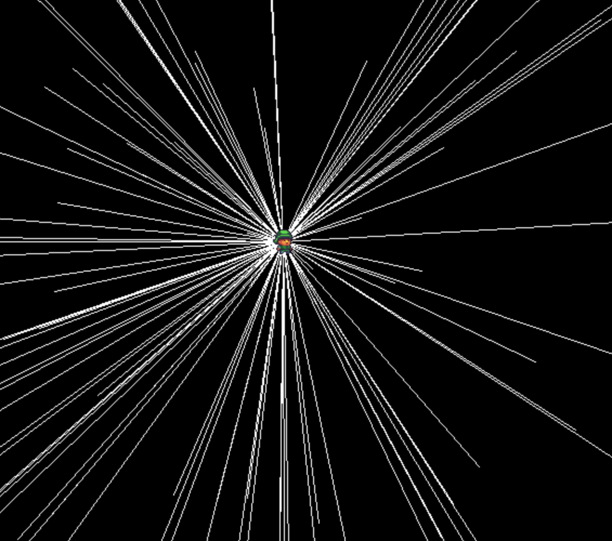
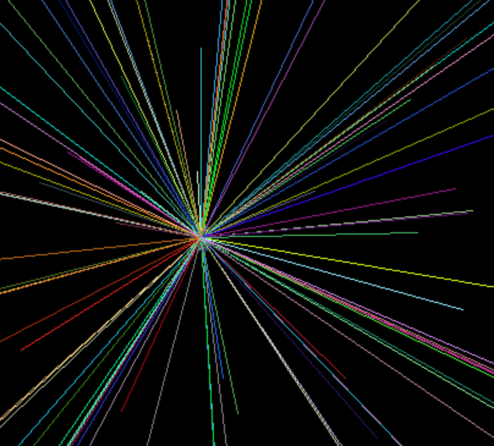
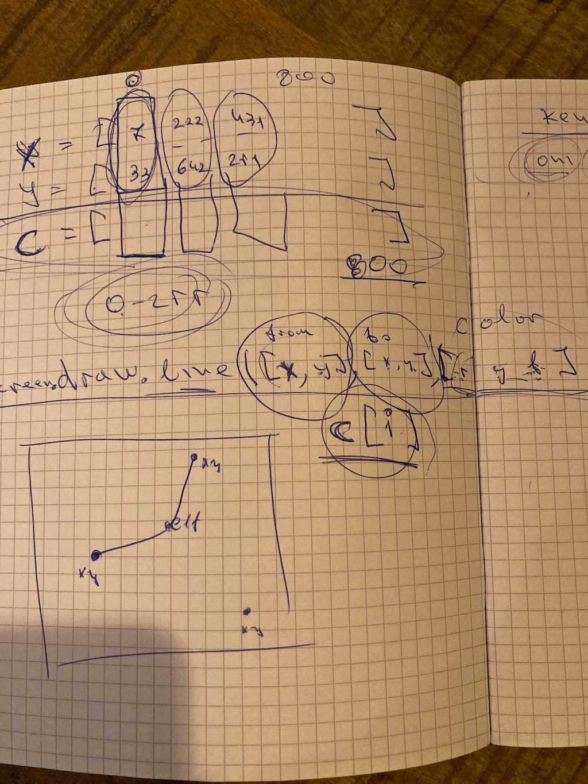
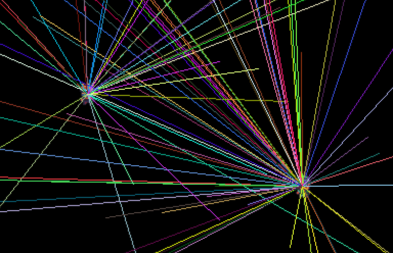

## [DAY-294] tutorials

Continue watching BroCode's [C tutorial for beginners](https://www.youtube.com/watch?v=nrbBmoINqtk&list=PLZPZq0r_RZOOzY_vR4zJM32SqsSInGMwe)


## [DAY-295] tutorials

Finish watching BroCode's [C tutorial for beginners](https://www.youtube.com/watch?v=nrbBmoINqtk&list=PLZPZq0r_RZOOzY_vR4zJM32SqsSInGMwe)


## [DAY-296] lists

Make 800 lines between random points and the elf, using two lists, one for the X of the lines and one for the Y of the lines.



```
import pgzrun
import random

WIDTH = 800
HEIGHT = 800

elf = Actor('c1')
elf.x = 500
elf.y = 500

lines_x=[]
lines_y=[]

for i in range(800):
    lines_x.append(random.randint(10,790))
    lines_y.append(random.randint(10,790))

def update():
    if keyboard.W:
        elf.y-=5
    if keyboard.S:
        elf.y += 5
    if keyboard.A:
        elf.x-=5
    if keyboard.D:
        elf.x+=5 

def draw():
    screen.fill('black')
    elf.draw()
    for i in range(100):
        screen.draw.line([lines_x[i],lines_y[i]],
                         [elf.x,elf.y],
                         [255,255,255)

pgzrun.go()
```


## [DAY-297] lists

Make the lines have different colors, using 3 more lists one for red, one for green and one for blue.






```
import pgzrun
import random

WIDTH = 800
HEIGHT = 800

elf = Actor('c1')
elf.x = 500
elf.y = 500

lines_x=[]
lines_y=[]
lines_red=[]
lines_green=[]
lines_blue=[]

for i in range(800):
    lines_x.append(random.randint(10,790))
    lines_y.append(random.randint(10,790))
    lines_red.append(random.randint(0,255))
    lines_green.append(random.randint(0,255))
    lines_blue.append(random.randint(0,255))

def update():
    if keyboard.W:
        elf.y-=5
    if keyboard.S:
        elf.y += 5
    if keyboard.A:
        elf.x-=5
    if keyboard.D:
        elf.x+=5 

def draw():
    screen.fill('black')
    elf.draw()
    for i in range(100):
        screen.draw.line([lines_x[i],lines_y[i]],
                         [elf.x,elf.y],
                         [lines_red[i],lines_green[i],lines_blue[i]])

pgzrun.go()

```


## [DAY-298] lists

Make the lines go either to the elf or to the king.





```
import pgzrun
import random

WIDTH = 800
HEIGHT = 800

elf = Actor('c1')
elf.x = 500
elf.y = 500

king = Actor('c2')
king.x = 500
king.y = 500

lines_x=[]
lines_y=[]
lines_red=[]
lines_green=[]
lines_blue=[]
lines_to=[]

for i in range(800):
    lines_x.append(random.randint(10,790))
    lines_y.append(random.randint(10,790))
    lines_red.append(random.randint(0,255))
    lines_green.append(random.randint(0,255))
    lines_blue.append(random.randint(0,255))
    lines_to.append(random.choice(['king','elf']))

    
def update():
    if keyboard.W:
        elf.y-=5
    if keyboard.S:
        elf.y += 5
    if keyboard.A:
        elf.x-=5
    if keyboard.D:
        elf.x+=5 

    if keyboard.UP:
        king.y-=5
    if keyboard.DOWN:
        king.y += 5
    if keyboard.LEFT:
        king.x-=5
    if keyboard.RIGHT:
        king.x+=5 

def draw():
    screen.fill('black')
    elf.draw()
    king.draw()
    for i in range(100):
        if lines_to[i] == 'king':
            screen.draw.line([lines_x[i],lines_y[i]],
                             [king.x,king.y],
                             [lines_red[i],lines_green[i],lines_blue[i]])
        else:
            screen.draw.line([lines_x[i],lines_y[i]],
                             [elf.x,elf.y],
                             [lines_red[i],lines_green[i],lines_blue[i]])
                    

pgzrun.go()
```
