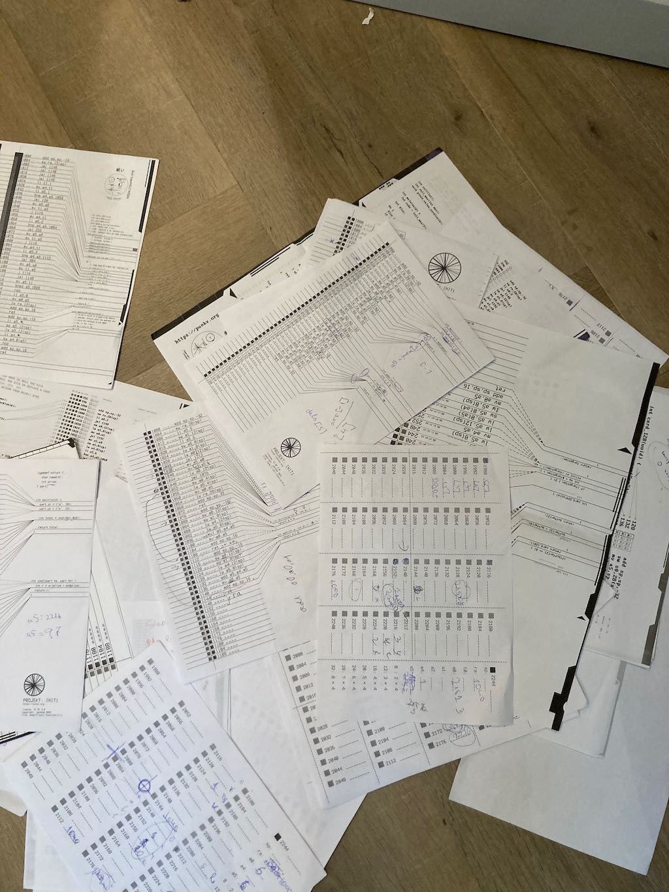

## [DAY-355] riscv assembler

Tle last month or so we spent learning RISCV assembler while making a board game: [PROJEKT:OVERFLOW](https://punkx.org/overflow/)

Each day I made an exercise and then we wrote (either together or her own) the execution of the program, you can see most of the examples at https://punkx.org/overflow/#assembly

I am attaching the photos of some of the work just for the record:




## [DAY-356] pointers


## [DAY-357] buffer overflow

Play a round of easy mode projekt:overflow https://punkx.org/overflow


## [DAY-358] buffer overflow

Play a round of easy mode projekt:overflow https://punkx.org/overflow


## [DAY-359] scanf; printf

Get 4 numbers from the user and print them.

```
#include <stdio.h>
int main(void){
    int number1, number2, number3, number4;
    printf("Choose 4 numbers: ");
    scanf("%d %d %d %d",&number1,&number2,&number3,&number4);
    printf("You chose: %d %d %d %d\n",number1,number2,number3,number4);
    return 0;
}

```

## [DAY-360] fscanf

Read all lines from a file, each containing 4 numbers, and print the numbers

```
#include <stdio.h>
int main(void){
    int number1, number2, number3, number4;
    FILE *fp;
    fp = open("numbers.txt","r");
    while(1)
        int r = fscanf(fp,"%d %d %d %d",&number1,&number2,&number3,&number4);
        if (r == EOF) {
            break;
        }
        printf("numbers: %d %d %d %d\n",number1,number2,number3,number4);
    }
    return 0;
}

```
